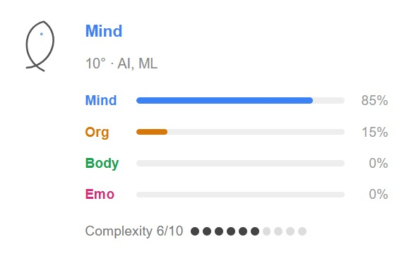
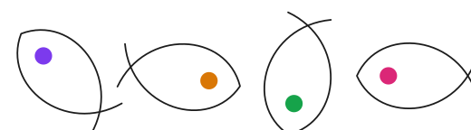
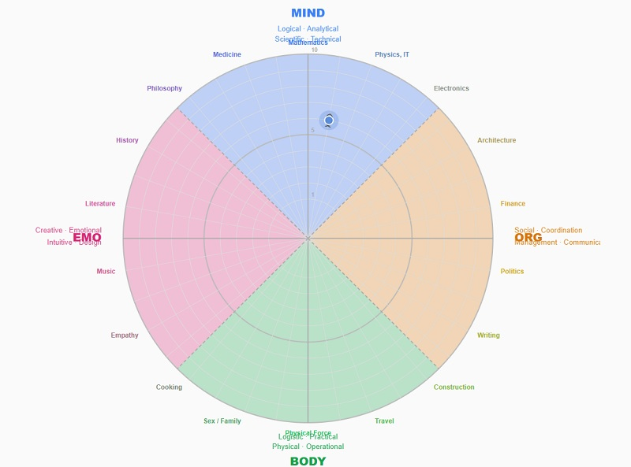

# Fisheye 360 — Text Classifier

### 🔗 [**Try it live → lit-u.github.io/fisheye-360**](https://lit-u.github.io/fisheye-360/)

<svg width="48" height="58" viewBox="0 0 100 120" xmlns="http://www.w3.org/2000/svg"><g transform="rotate(315 50 60)"><path d="M 30 116 C 88 100, 97 26, 50 5 C 3 26, 12 100, 70 116" fill="none" stroke="#1c1c1c" stroke-width="1.5" stroke-linecap="round" stroke-linejoin="round"/><circle cx="50" cy="34" r="8" fill="#7c3aed"/></g></svg>



**Fisheye 360** classifies any text across a **360° semantic compass** — and shows the result as a rotating fish glyph pointing toward the dominant theme.

```
         MIND (0°)
            ↑
  EMO ←  🐟  → ORG
            ↓
         BODY (180°)
```

The fish always points its nose in the direction of the content. A political speech points East. A recipe points South. A philosophy essay points West-Northwest.

---

## Why does this exist?

Most people navigate text the way they navigate an unfamiliar city — by landmarks, not by compass. They recognize what they've seen before, stay inside familiar clusters, and drift into information bubbles without noticing.

**Three observations behind this project:**

1. **People lose orientation while reading.** Without a spatial model of topics, it's hard to notice when a conversation shifts from facts to emotion, from analysis to propaganda, or from science to opinion. A compass helps.

2. **The theoretical foundation** draws from behaviorism and neuroscience, and from earlier attempts to build orientation systems — including Jungian typologies. The MOBE axes (Mind–Org–Body–Emo) reflect four distinct modes of human engagement with the world.

3. **The same 36-category compass applies to skills and careers.** The complexity scale (1–10) was designed so that the lower levels map directly to child development — making it possible to use this system to recommend learning activities that build skills like LEGO blocks, layer by layer.

---

## The Fish Glyph



*Fish glyphs pointing toward: Emo+Mind (315°) · Org/Politics (100°) · Body/Food (190°) · Emo/Drama (270°)*

The fish is defined by a single SVG path:

```js
const FISH_PATH = 'M 30 116 C 88 100, 97 26, 50 5 C 3 26, 12 100, 70 116';
```

Rotate it to any angle — it always points its nose in that direction. Designed to be embedded anywhere: inline in text, in tooltips, in dashboards.

```html
<!-- Fish pointing toward Politics (100°) -->
<svg width="18" height="22" viewBox="0 0 100 120">
  <g transform="rotate(100 50 60)">
    <path d="M 30 116 C 88 100, 97 26, 50 5 C 3 26, 12 100, 70 116"
      fill="none" stroke="#d97706" stroke-width="1.5"
      stroke-linecap="round" stroke-linejoin="round"/>
    <circle cx="50" cy="34" r="8" fill="#d97706"/>
  </g>
</svg>
```

---

## The 360° Compass



The compass has **4 primary axes**, each spanning 90°:

| Axis | Angle | Domain |
|------|-------|--------|
| **MIND** | 0° | Abstract reasoning — Math, Physics, AI, Algorithms |
| **ORG** | 90° | Human coordination — Law, Politics, Finance, Management |
| **BODY** | 180° | Physical world — Sports, Food, Construction, Travel |
| **EMO** | 270° | Inner world — Music, Art, Psychology, Philosophy, Medicine |

Between axes — **32 transition categories** at every 10°:

`0° Math` → `10° AI/ML` → `20° Physics/IT` → `30° Engineering` → `40° Electronics` → `50° Mechanics` → `60° Architecture` → `70° Statistics` → `80° Finance` → `90° Law` → `100° Politics` → `110° Governance` → `120° Writing` → `130° Crafts` → `140° Construction` → `150° Religion` → `160° Travel` → `170° Aggression` → `180° Physical Force` → `190° Food` → `200° Sex/Family` → `210° Home` → `220° Cooking` → `230° Care` → `240° Empathy` → `250° Fashion` → `260° Music` → `270° Drama` → `280° Literature` → `290° Media/Design` → `300° History/Journalism` → `310° Psychology` → `320° Philosophy` → `330° Biology` → `340° Medicine` → `350° Chemistry`

---

## Complexity Scale (1–10)

Complexity measures the **expertise level required** to understand the text:

| Level | Description |
|-------|-------------|
| 1 | Toddler — motor skills, basic surroundings |
| 2 | Children 6–13 — theoretical knowledge, minimal practice |
| 3 | Teenagers 14–18 — strong reasoning, weak practice |
| 4 | Average adult — basic tasks (Photoshop, a recipe) |
| 5 | School A-student — medium complexity |
| 6 | Apprentice / strong hobbyist — junior developer, competitive gamer |
| 7 | Young professional — Middle developer level |
| 8 | Senior specialist — national-level expert |
| 9 | Top mastery — international projects, world-class |
| 10 | Genius level — global innovators, groundbreaking science |

> Levels 1–4 are particularly useful for **children's education** — matching learning activities to a child's current level so skills compound like building blocks.

---

## How It Works

1. **Paste text** (any language)
2. An LLM segments it into **3–7 thematic chunks**
3. Each chunk is classified: `angle` (0–350°), `category`, `complexity`
4. The **fish glyph** rotates to point in the direction of the dominant theme
5. The **360° radar diagram** shows all segments as dots on the compass

All in a **single LLM API call** — fast and cost-efficient.

> Paste a political article → fish points toward `Org/Politics (100°)`  
> Paste a recipe → fish points toward `Body/Food (190°)`  
> Paste a philosophy essay → fish points toward `Emo/Philosophy (320°)`  
> Paste a scientific paper → fish points toward `Mind/Biology (330°)` with complexity 9–10

---

## Getting Started

### Frontend only — no server needed

Open [`public/annotator-standalone.html`](public/annotator-standalone.html) in any browser.  
Enter your API key — it stays in `localStorage`, never leaves your browser.

**Supported providers:** Groq (free tier), OpenAI, OpenRouter

The obvious knobs are at the top of `annotator-standalone.html` — `PROVIDERS`, `SYSTEM_PROMPT`, `max_tokens`, segment count, `KW_MAP`.

### Self-host (Node.js)

```bash
git clone https://github.com/lit-u/fisheye-360.git
cd fisheye-360
npm install
cp .env.example .env
# Add your GROQ_API_KEY to .env
npm start
# Open http://localhost:3000/annotator.html
```

---

## Stack

- **Frontend:** Vanilla JS, SVG — no framework
- **Backend:** Node.js + Express (one route)
- **LLM:** [Groq](https://groq.com) (`llama-3.1-8b-instant`) — fast, free tier available
- **Fallback:** Keyword classifier — works offline, no API key needed

---

## Customization

**Change the LLM provider:**  
Edit `server/mobe-classify.js` — any OpenAI-compatible API works.

**Translate categories:**  
Labels are in Lithuanian by default. English names are in comments — PR welcome.

---

## Related

- [sekmes.lt/360](https://www.sekmes.lt/360) — interactive 36-category hard skills self-assessment wheel (the same compass, applied to career development)

---

## License

MIT © [oldboy_palanga](https://github.com/lit-u)

---

## Contributing

PRs welcome. Especially interested in:
- English category translations
- Additional LLM provider adapters
- Improved disambiguation rules for edge cases
- Chrome extension version
